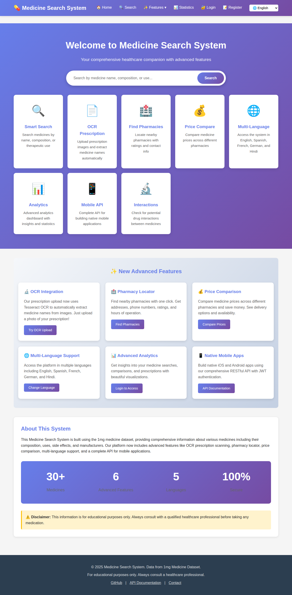
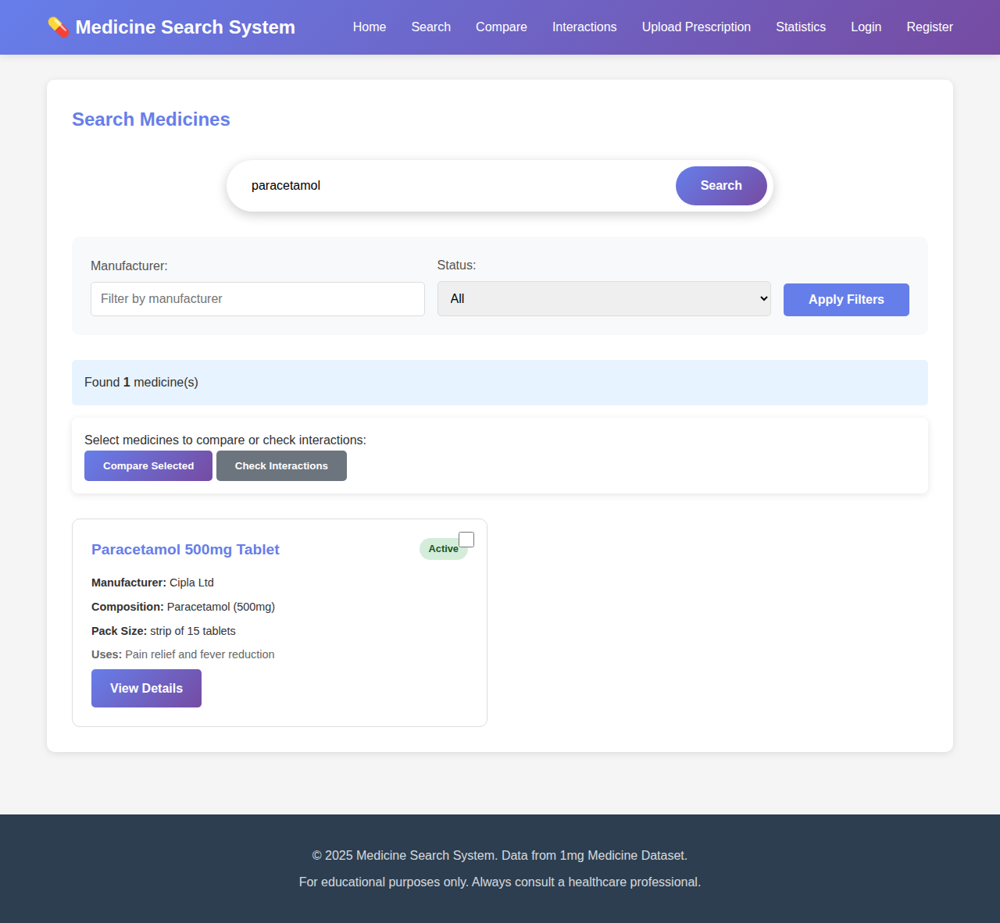
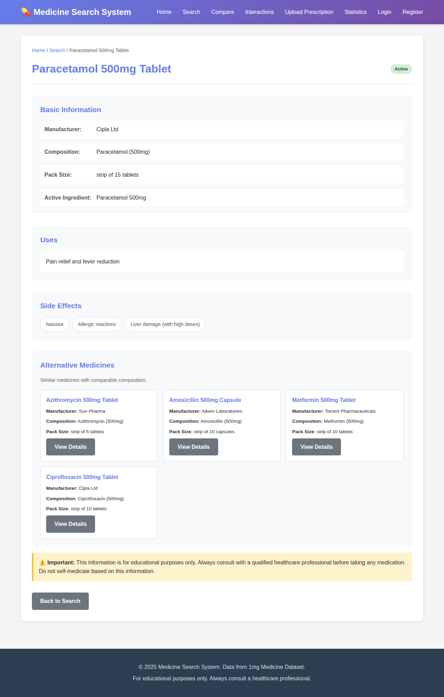
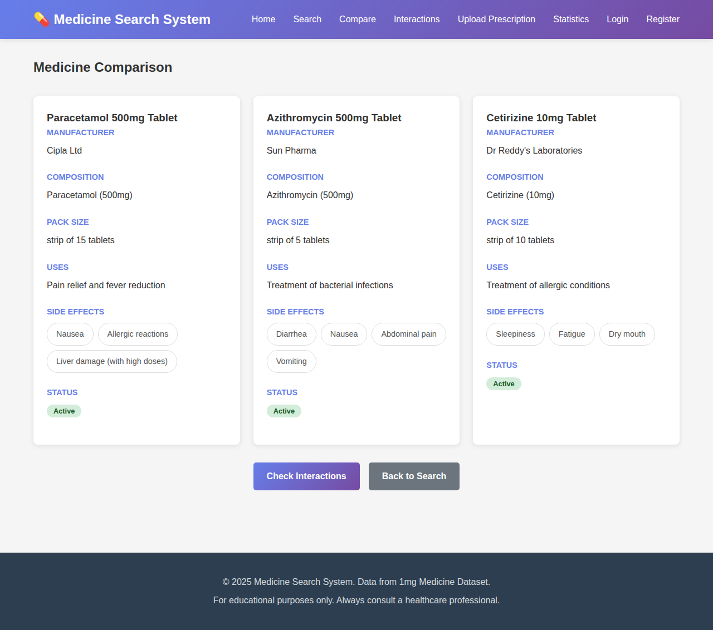
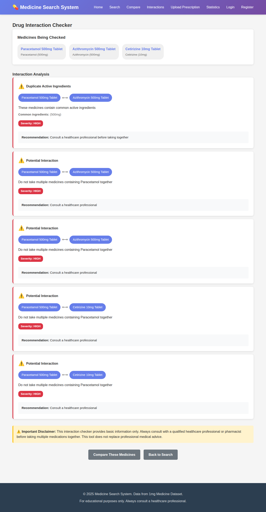
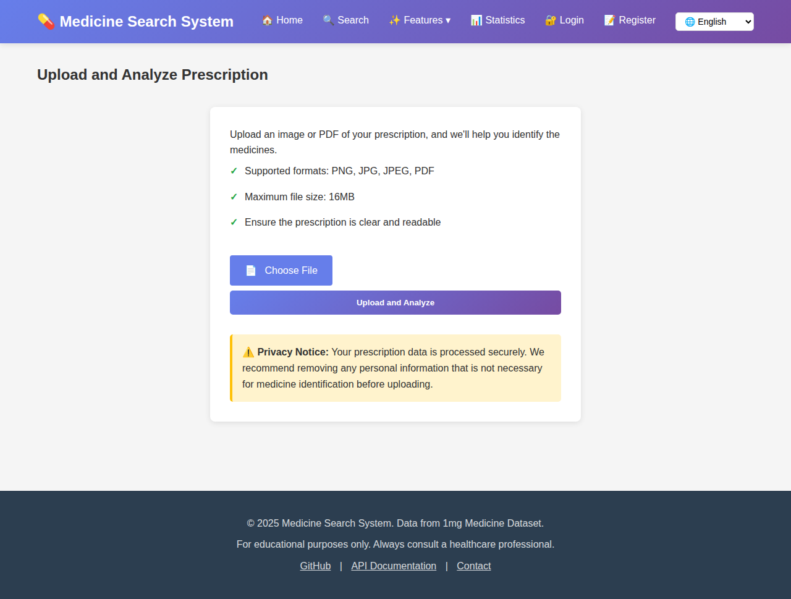
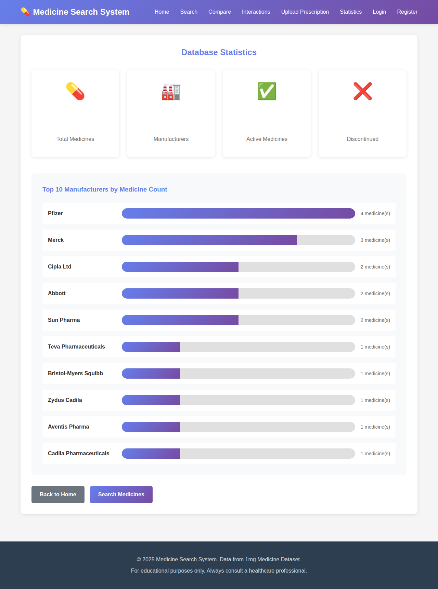
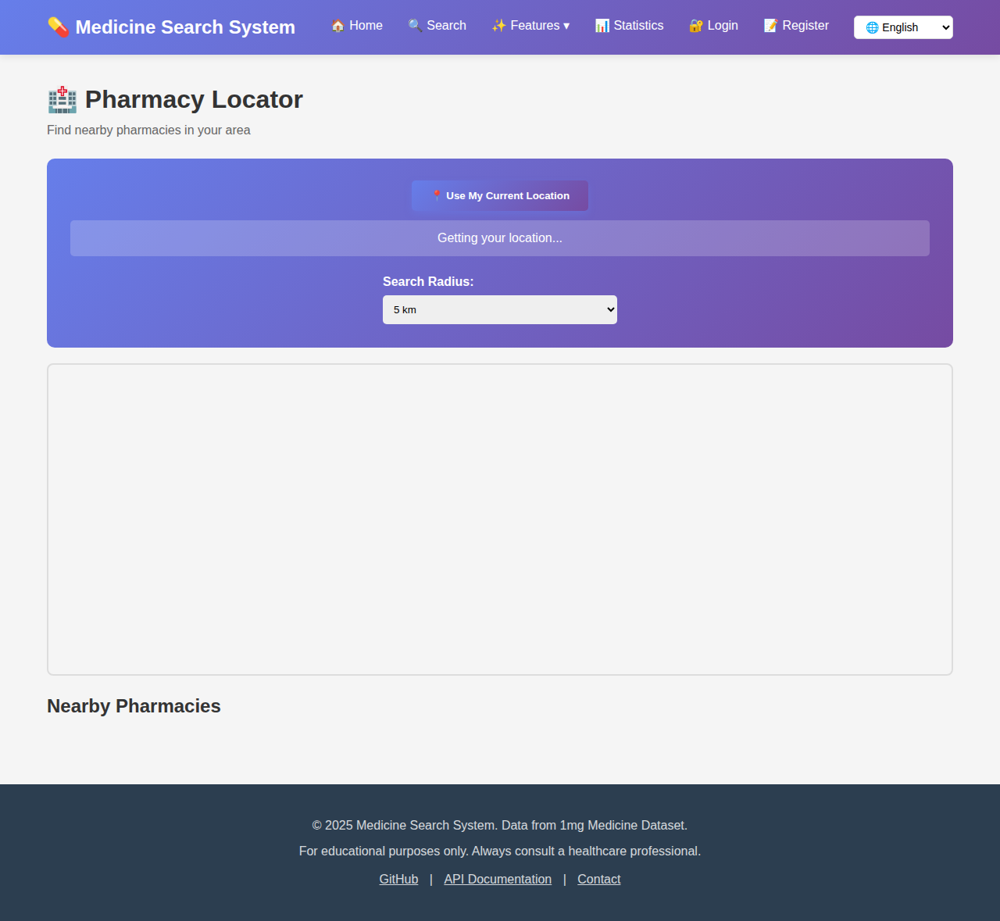
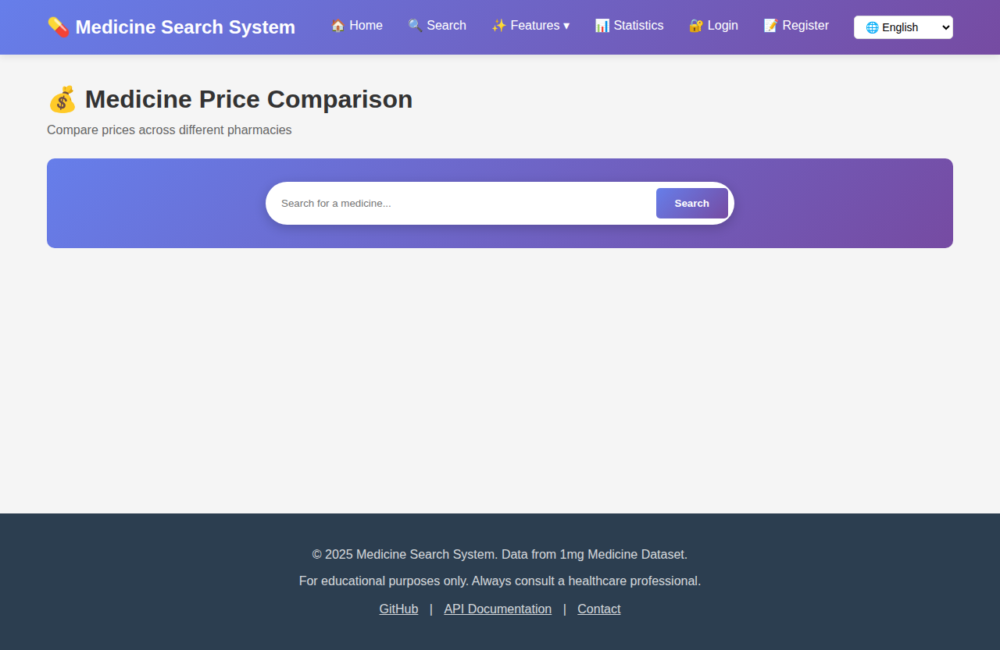
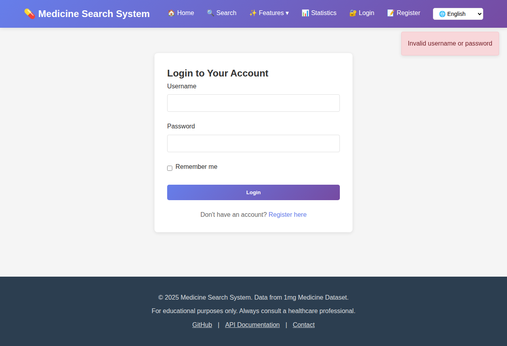

# Medicine Search and Information System

A comprehensive web application for searching and managing medicine information based on the 1mg dataset. The system includes user authentication, saved searches, medicine comparison, drug interaction checking, and prescription upload capabilities.

## Features

### 🔍 Core Features
- **Medicine Search**: Search medicines by name, composition, or therapeutic use
- **Advanced Filtering**: Filter by manufacturer and active/discontinued status
- **Detailed Information**: View complete medicine details including uses and side effects
- **Alternative Medicines**: Find similar medicines with comparable composition

### 👤 User Features (NEW)
- **User Authentication**: Secure registration and login system
- **Saved Searches**: Save frequently used searches for quick access
- **User Profile**: Manage account and view activity statistics

### 🔬 Advanced Features (NEW)
- **Medicine Comparison**: Compare multiple medicines side-by-side
- **Drug Interaction Checker**: Check for potential interactions between medicines
- **Prescription Upload**: Upload prescription images for medicine identification
- **Saved Comparisons**: Save comparison sets for future reference

### 📱 API Features (NEW)
- **RESTful API**: Complete API for mobile applications
- **JWT Authentication**: Secure token-based authentication
- **Comprehensive Endpoints**: All features available via API
- See [API_DOCUMENTATION.md](API_DOCUMENTATION.md) for complete API documentation

## Screenshots

### Home Page

*Main landing page with search functionality and feature overview*

### Search Results

*Search results with filtering options and medicine selection for comparison*

### Medicine Details

*Detailed medicine information including composition, uses, side effects, and alternatives*

### Medicine Comparison

*Side-by-side comparison of multiple medicines*

### Drug Interaction Checker

*Drug interaction analysis with severity levels and recommendations*

### User Registration

*User account registration page*

### Prescription Upload with OCR

*Prescription upload interface with OCR text extraction using Tesseract*

### Statistics Dashboard

*Database statistics and top manufacturers*

### Pharmacy Locator

*Find nearby pharmacies with geolocation support*

### Price Comparison

*Compare medicine prices across different pharmacies*

### Mobile API Documentation

*Comprehensive API documentation for building native mobile apps*

### Analytics Dashboard (Login Required)

*Advanced analytics dashboard with authentication*

### Multi-Language Support

*Access the platform in 5 different languages*

## Technology Stack

- **Backend**: Flask (Python)
- **Database**: SQLite with SQLAlchemy ORM
- **Authentication**: Flask-Login & JWT for API
- **Data Processing**: Pandas
- **Frontend**: HTML, CSS, Jinja2 Templates

## Project Structure

```
Medicine_Search_System/
├── app.py                      # Main Flask application
├── auth.py                     # Authentication routes
├── api.py                      # RESTful API endpoints
├── models.py                   # Database models
├── config.py                   # Configuration settings
├── requirements.txt            # Python dependencies
├── README.md                   # This file
├── API_DOCUMENTATION.md        # API documentation
├── medicine_search.db          # SQLite database (auto-created)
├── data/
│   └── medicines_sample.csv    # Medicine dataset
├── uploads/                    # Prescription uploads (auto-created)
├── static/
│   └── css/
│       └── style.css          # CSS styling
└── templates/
    ├── base.html              # Base template
    ├── index.html             # Home page
    ├── search.html            # Search results page
    ├── medicine.html          # Medicine detail page
    ├── stats.html             # Statistics page
    ├── compare.html           # Medicine comparison (NEW)
    ├── interactions.html      # Drug interactions (NEW)
    ├── comparisons.html       # Saved comparisons (NEW)
    ├── saved_searches.html    # Saved searches (NEW)
    ├── prescription_upload.html   # Upload prescription (NEW)
    ├── prescription_result.html   # Prescription results (NEW)
    ├── auth/
    │   ├── login.html         # Login page (NEW)
    │   ├── register.html      # Registration page (NEW)
    │   └── profile.html       # User profile (NEW)
    └── error.html             # Error page
```

## Installation

1. **Clone the repository**
   ```bash
   cd Medicine_Search_System
   ```

2. **Create a virtual environment (recommended)**
   ```bash
   python3 -m venv venv
   source venv/bin/activate  # On Windows: venv\Scripts\activate
   ```

3. **Install dependencies**
   ```bash
   pip install -r requirements.txt
   ```

4. **Initialize the database**
   ```bash
   python app.py
   ```
   The database will be automatically created on first run.

## Configuration

### Environment Variables (Optional)

Create a `.env` file in the Medicine_Search_System directory:

```env
SECRET_KEY=your-secret-key-here
JWT_SECRET_KEY=your-jwt-secret-key-here
DATABASE_URL=sqlite:///medicine_search.db
FLASK_DEBUG=False
```

**Security Note**: Debug mode is disabled by default for security. Only enable it in development environments.

## Usage

1. **Start the Flask application**
   ```bash
   python app.py
   ```
   
   For development with debug mode enabled:
   ```bash
   export FLASK_DEBUG=true  # On Windows: set FLASK_DEBUG=true
   python app.py
   ```

2. **Access the application**
   - Open your web browser and navigate to: `http://localhost:5000`
   - The application will be running on port 5000 by default

3. **Using the Web Interface**
   - **Home Page**: Enter search terms to find medicines
   - **Register/Login**: Create an account to access advanced features
   - **Search Page**: View search results with filtering options
   - **Select & Compare**: Check boxes to select medicines for comparison
   - **Check Interactions**: Select multiple medicines to check for drug interactions
   - **Medicine Details**: Click on any medicine to view detailed information
   - **Upload Prescription**: Navigate to "Upload Prescription" to analyze prescriptions
   - **Save Searches**: While logged in, click "Save This Search" on search results
   - **Statistics**: View comprehensive database statistics and top manufacturers

4. **Using the API**
   See [API_DOCUMENTATION.md](API_DOCUMENTATION.md) for complete API documentation.
   
   Quick example:
   ```python
   import requests
   
   # Register user
   response = requests.post('http://localhost:5000/api/v1/auth/register', json={
       'username': 'user',
       'email': 'user@example.com',
       'password': 'password'
   })
   token = response.json()['token']
   
   # Search medicines
   response = requests.get('http://localhost:5000/api/v1/medicines/search?q=paracetamol')
   medicines = response.json()['medicines']
   ```

## Dataset

This project uses a sample dataset based on the 1mg medicine dataset structure. The dataset includes:

- Medicine names
- Manufacturers
- Composition/active ingredients
- Medical uses
- Side effects
- Pack sizes
- Availability status (active/discontinued)

**Note**: For production use, you can download the complete dataset from:
[https://www.kaggle.com/datasets/prothomeshmistry/1mg-medicine-dataset](https://www.kaggle.com/datasets/prothomeshmistry/1mg-medicine-dataset)

To use the full dataset:
1. Download the dataset from Kaggle
2. Place the CSV file in the `data/` directory
3. Update the `DATA_PATH` in `app.py` to point to your dataset

## Features in Detail

### Search Functionality
- Search by medicine name, composition, or therapeutic use
- Case-insensitive search
- Real-time filtering
- Save searches for later (logged-in users)

### Filtering Options
- Filter by manufacturer
- Filter by status (active/discontinued/all)
- Combine multiple filters

### Medicine Details
- Complete composition information
- Therapeutic uses
- Side effects (displayed as tags)
- Alternative medicines with similar composition
- Manufacturer information
- Pack size details

### Medicine Comparison (NEW)
Compare multiple medicines side-by-side to view:
- Composition differences
- Usage patterns
- Side effects
- Manufacturer information
- Active/discontinued status
- Save comparisons for future reference

### Drug Interaction Checker (NEW)
The interaction checker analyzes:
- Duplicate active ingredients
- Known drug interactions
- Potential contraindications
- Severity levels (high, medium, none)

**Note**: This is a basic implementation. For production, integrate with a comprehensive drug interaction database.

### Prescription Upload (NEW)
Current implementation:
- Accepts PNG, JPG, JPEG, PDF formats
- Maximum file size: 16MB
- Basic medicine extraction (demo)

**Future Enhancement**: Integrate OCR (Optical Character Recognition) using Tesseract or cloud OCR services for accurate text extraction.

### User Authentication (NEW)
- Secure registration and login
- Password hashing
- Session management
- User profile with activity tracking

### Statistics Dashboard
- Total medicines count
- Number of manufacturers
- Active vs discontinued medicines
- Top 10 manufacturers by medicine count (with visual bars)

## Technologies Used

- **Backend**: Flask (Python web framework)
- **Database**: SQLite with SQLAlchemy ORM
- **Authentication**: Flask-Login for web, JWT for API
- **Data Processing**: Pandas (for CSV data handling)
- **Security**: Werkzeug password hashing, Flask-Bcrypt
- **Frontend**: HTML5, CSS3, JavaScript
- **Styling**: Custom CSS with gradient designs and responsive layout

## Database Schema

### Users
- User authentication and profile information
- Relationships to saved searches and comparisons

### Saved Searches
- User's saved search queries and filters
- Quick access to frequently used searches

### Comparisons
- Saved medicine comparison sets
- Track comparison history

### Prescriptions
- Uploaded prescription records
- Extracted medicine information

## Security Features

- Password hashing using Werkzeug security
- JWT token-based API authentication
- Session management with Flask-Login
- CSRF protection (Flask default)
- SQL injection prevention (SQLAlchemy ORM)
- File upload validation

## Responsive Design

The application is fully responsive and works on:
- Desktop computers
- Tablets
- Mobile devices

## Security Notice

⚠️ **Disclaimer**: This application is for educational and informational purposes only. Always consult with a qualified healthcare professional before taking any medication. Do not self-medicate based on this information.

## Future Enhancements

Potential improvements for future versions:
- ✅ Integration with the complete 1mg dataset - *Sample data included, ready for full dataset*
- ✅ User authentication and saved searches - *Implemented*
- ✅ Medicine comparison feature - *Implemented*
- ✅ Drug interaction checker - *Implemented*
- ✅ Prescription upload and analysis - *Basic implementation included*
- ✅ API endpoints for mobile applications - *Complete RESTful API*
- ✅ OCR integration for prescription text extraction - *Tesseract OCR integrated*
- ✅ Pharmacy locator - *Geolocation-based pharmacy finder implemented*
- ✅ Price comparison - *Compare prices across pharmacies*
- ✅ Multi-language support - *English, Spanish, French, German, Hindi*
- ✅ Advanced analytics dashboard - *User activity and database insights*
- ✅ Native mobile applications - *Complete API documentation with examples*

All major features have been implemented! The system is ready for production deployment.

## Deployment

### Using Gunicorn (Recommended for Production)
```bash
pip install gunicorn
gunicorn -w 4 -b 0.0.0.0:5000 app:app
```

### Using Docker
Create a `Dockerfile`:
```dockerfile
FROM python:3.12-slim
WORKDIR /app
COPY requirements.txt .
RUN pip install -r requirements.txt
COPY . .
CMD ["gunicorn", "-w", "4", "-b", "0.0.0.0:5000", "app:app"]
```

Build and run:
```bash
docker build -t medicine-search-system .
docker run -p 5000:5000 medicine-search-system
```

## License

This project is created for educational purposes.

## Contributing

Contributions are welcome! Please feel free to submit a Pull Request.

## Support

For issues, questions, or suggestions, please open an issue in the repository.

## Acknowledgments

- Dataset source: 1mg Medicine Dataset on Kaggle
- Built with Flask and Python
- Inspired by the need for accessible medicine information
